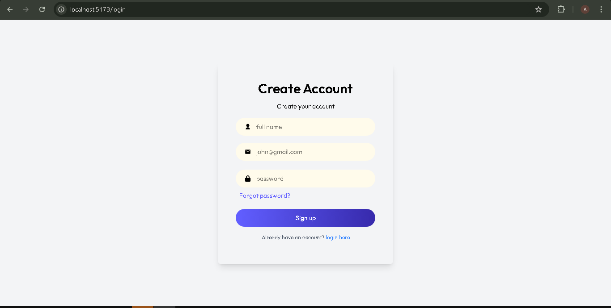

🩺 Doctor Booking Appointment App

A MERN-based healthcare appointment system that enables patients to book, manage, and track doctor appointments online.
It also includes a secure Admin Panel for managing doctors, patients, and appointments — built with a clean UI and Context API-based state management.

🚀 Project Overview

The Doctor Booking Appointment App simplifies online doctor appointment booking.
Patients can find doctors, book slots, and manage appointments, while the admin handles system data from an interactive dashboard.

Built for scalability, security, and user experience using the MERN stack.

🛠️ Tech Stack
Layer	Technology
Frontend	React.js + Tailwind CSS
State Management	Context API
Backend	Node.js + Express.js
Database	MongoDB (Atlas)
Authentication	JWT (JSON Web Token)
Hosting	Vercel (Full Stack Deployment)
🔑 Current Features

✅ Secure JWT Authentication (Login / Signup)

✅ Book, view, and cancel doctor appointments

✅ Doctor listing with filters & categories

✅ Admin Panel for managing doctors, users & bookings

✅ Context API-based global state management

✅ Fully responsive UI for all devices

👩‍⚕️ Admin Panel Screenshots
🔐 Admin Login Page

📸 **Screenshots  
>   
>   

🧑‍⚕️ Dashboard Overview

➕ Add New Doctor

📅 Appointments Management

📊 Folder Structure
doctor-booking-app/
┣ 📂 client/                  # React Frontend
┃ ┣ 📂 src/
┃ ┃ ┣ 📂 components/
┃ ┃ ┣ 📂 pages/
┃ ┃ ┣ 📂 context/
┃ ┃ ┣ 📂 assets/
┃ ┃ ┗ 📜 App.js
┃ ┗ 📜 package.json
┣ 📂 server/                  # Node + Express Backend
┃ ┣ 📂 models/
┃ ┣ 📂 routes/
┃ ┣ 📂 controllers/
┃ ┣ 📂 middleware/
┃ ┗ 📜 server.js
┣ 📜 README.md
┗ 📜 package.json

📌 Future Enhancements
🧠 Advanced Features

Online payments

Appointment reminders via email/SMS

Doctor availability calendar

🎨 UI/UX

Dark/Light mode

Enhanced dashboard visuals

Loading skeletons for smooth UX

🩺 Admin Tools

Role-based access (Admin, Doctor, Patient)

Analytics dashboard

Verification system for new doctors

👩‍💻 Role & Contributions

Built Admin Panel (CRUD operations for doctors & appointments)

Integrated Node.js/Express API with MongoDB

Implemented JWT authentication system

Designed frontend using React + Tailwind CSS

Managed state using Context API

Deployed frontend and backend on Vercel

